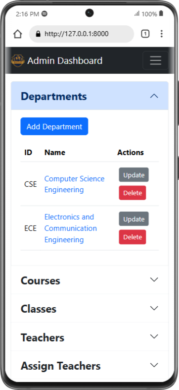

# University Enterprise Resource Planning System
 **U**niversity **E**nterprise **R**esource **P**lanning **S**ystem (**UERPS**) created using the Django framework, facilitating smooth interactions between students and teachers. **UERPS** core features include managing attendance, tracking marks, and organizing a timetable.

- **Department**
    - A department serves as an educational sub-unit within the college, offering a variety of programmes and courses. Each department is overseen by a Head of the Department (HOD), who manages its operations and ensures effective functioning.

- **Course**
    - A course refers to a subject offered by a department during a semester, which students are required to complete to qualify for the Semester Final Examination (SFE) and, ultimately, the award of a Bachelor's Degree.

- **Semester**
    - A semester is a time period of five months during which a department offers a set of courses to students. Each academic year is composed of three semesters, including two regular semesters and one supplementary semester.
- **Continuous Internal Evaluation**
    - Continuous Internal Evaluation (CIE) is a system of ongoing assessments conducted throughout the semester to evaluate a student's academic performance. It typically consists of five events or examinations. At the end of the semester, the results from these evaluations are summed up and reduced to a total of 50 marks. 

- **Semester Final Examination**
    - The Semester Final Examination (SFE) is held at the conclusion of each semester to evaluate a student's academic performance. It is conducted for a total of 100 marks, which are then scaled down to 50 marks in the final assessment.

## UERPS Features
- ### Login
    - Common login page for Student, Teacher HOD and Admin
    - Django Allauth Authentication
- ### Admin Dashboard
    - Manage Departments, Courses, Classes and Marks
    - Manage Student and Teacher profiles
    - Schedule Classes (Timetable)
    - Reset Attendance
    - All the above operations can also be done using Django Administration
- ### HOD Dashboard
    - Manage Courses and Classes
    - Manage Student and Teacher profiles
    - Schedule Classes (Timetable)
    - View whole Department Timetable
    - View Student Marks
    - Manage Student Attendance
    - Reports
- ### Teacher Dashboard
    - Manage Attendance
    - Manage Marks
    - View Timetable
    - Reports
    - **View as HOD** is visible if teacher is HOD (for switching to HOD Dashboard)
- ### Student Dashboard
    - View Attendance
    - View Marks
    - View Timetable

## Installing
### Clone the project

```bash
git clone https://github.com/shivatejaburle/university-erp
cd university-erp
```

### Setup your Virtual Environment
```bash
pip install virtualenv
virtualenv venv
# For Windows
venv\Scripts\activate   
# For Mac
source venv/bin/activate 
```

### Install dependencies
```bash
pip install -r requirements.txt
```
### Collect static files (only on a production server)

```bash
python manage.py collectstatic
```

### Running a development server

Just run this command:

```bash
python manage.py runserver
```
Your application will be available @ http://127.0.0.1:8000/

### Login Information
- **Admin**: 
    - Username : admin
    - Password : Univ#12345
- **HOD and Teacher**: 
    - Username : aditi_t001
    - Password : aditi_1990
- **Student**: 
    - Username : neha_001
    - Password : neha_1990

## Screenshots
### Home Page

### Login Page

### Admin Dashboard


    **Note:** This action removes all existing attendance records and generates new ones within the specified time range.
### HOD Dashboard


### Teacher Dashboard


### Student Dashboard


### Mobile View
&emsp;&emsp;&emsp;&emsp;

&emsp;&emsp;&emsp;&emsp;

&emsp;&emsp;&emsp;&emsp;

**Note:** All pages are responsive with small, medium and large devices.